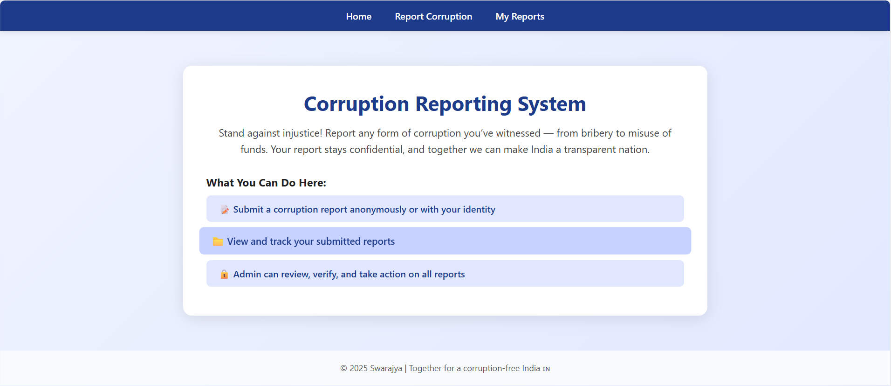
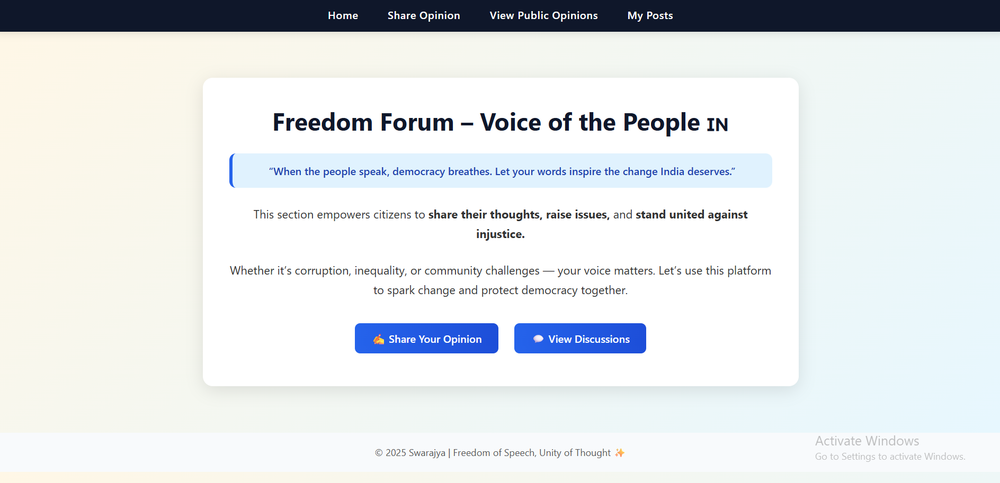

🕊️ Swarajya – A Platform for Social Justice & Humanity
🌍 Overview

Swarajya is a Django-based social impact web platform designed to empower citizens to take action against social issues like corruption, rape/harassment, and poverty.
It connects people who want to help with those in need and provides a safe space for victims to raise their voices without fear.
____
🚀 Features
🧑‍⚖️ Corruption Reporting

Report corruption cases confidentially.

Every report is handled securely by the admin team.

Citizens can track their submitted complaints.

🕊️ Rape & Harassment Reporting

Safe, anonymous space for victims to report incidents.

Admin-only access to sensitive data.

Victims can view their own reports securely.

🤝 Helping Hand

Offer help (food, clothes, education, shelter).

Request support for essentials.

Transparent platform connecting donors and recipients.

🗣️ Freedom Forum (Upcoming Feature)

A place for citizens to raise issues, share opinions, and unite for justice.

Discussion threads for awareness and collective action.

🧩 Tech Stack

Backend: Django, Python

Frontend: HTML, CSS, JavaScript

Database: SQLite (can be replaced with MySQL/PostgreSQL)

Version Control: Git & GitHub

⚙️ Installation Guide

Clone this repository

git clone https://github.com/shraddha11953/Swarajya.git
cd Swarajya

Create and activate a virtual environment

python -m venv venv
venv\Scripts\activate      # Windows
source venv/bin/activate   # Mac/Linux

Install dependencies

pip install -r requirements.txt

Run migrations

python manage.py makemigrations
python manage.py migrate

Start the server

python manage.py runserver

Open your browser and visit
👉 http://127.0.0.1:8000/

📸 Screenshots
🏠**Home Page:**  

💰 Corruption Section

🗣️ Freedom Forum

💔 Rape Reporting

🤝 Helping Hand

👩‍💻 Author

Shraddha Jadhav
💡 Passionate about creating technology that drives real change.
📧 shraddha9503@gmail.com
